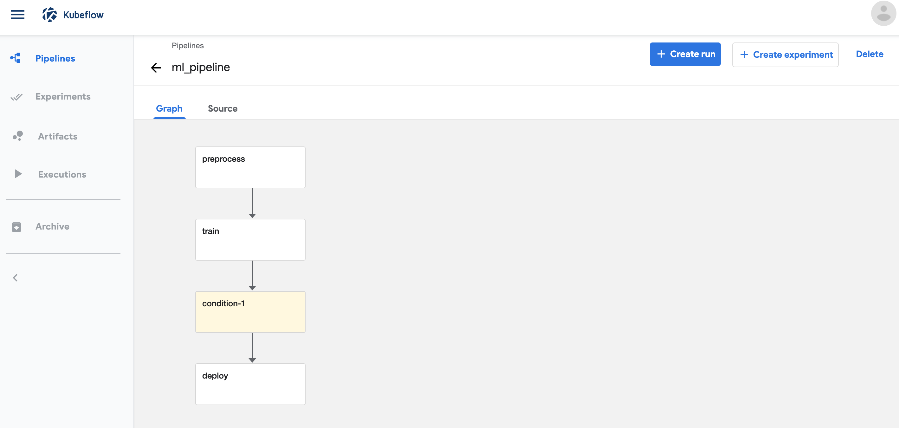
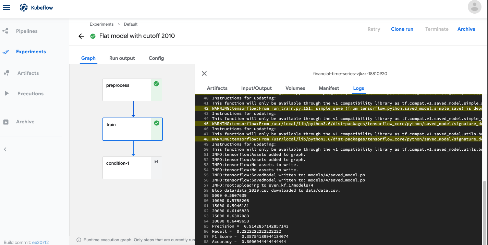

Using Kubeflow for Financial Time Series
====================

In this example, we will walk through the exploration, training and serving of a machine learning model by leveraging Kubeflow's main components. 
We will use the [Machine Learning with Financial Time Series Data](https://cloud.google.com/solutions/machine-learning-with-financial-time-series-data) use case.

## Goals

There are two primary goals for this tutorial:

*   Demonstrate an End-to-End kubeflow example
*   Present a financial time series model example

By the end of this tutorial, you should learn how to:

*   Setup a Kubeflow cluster 
*   Spawn a Jupyter Notebook on the cluster
*   Train a time-series model using TensorFlow and GPUs on the cluster (To be added)
*   Serve the model using [TF Serving](https://www.kubeflow.org/docs/components/serving/tfserving_new/) (To be added)
*   Query the model via your local machine (To be added)
*   Automate the steps 1/ preprocess, 2/ train and 3/ model deployment through a kubeflow pipeline


### Kubeflow Pipelines
Up to now, we clustered the preprocessing, training and deploy in a single script to illustrate the TFJobs.
In practice, most often the preprocessing, training and deploy step will separated and they will need to run sequentially.
Kubeflow pipelines offers an easy way of chaining these steps together and we will illustrate that here.
As you can see, the script `run_preprocess_train_deploy.py` was using the scripts `run_preprocess.py`, `run_train.py` and `run_deploy.py` underlying.
The idea here is that these three steps will be containerized and chained together by Kubeflow pipelines.
We will also introduce a condition that we will only deploy the model if the accuracy on the test set surpasses a treshold of 70%.

Kubeflow Pipelines asks us to compile our pipeline Python3 file into a domain-specific-language. 
We do that with a tool called dsl-compile that comes with the Python3 SDK. So, first install that SDK:

```
pip3 install python-dateutil kfp==0.1.36
```

Please inspect the `ml_pipline.py` and update the `ml_pipeline.py` with the cpu image path that you built in the previous steps.
Then, compile the DSL, using:

```
python3 ml_pipeline.py
```

Now a file `ml_pipeline.py.tar_gz` is generated that we can upload to the kubeflow pipelines UI.
We will navigate again back to the Kubeflow UI homepage on `https://<KF_NAME>.endpoints.<project_id>.cloud.goog/` and click on the 'Pipelines' in the menu on the left side.


Once the page is open, click 'Upload pipeline' and select the tar.gz file.
If you click on the pipeline you can inspect the Directed Acyclic Graph (DAG).



Next we can click on the pipeline and create a run. For each run you need to specify the params that you want to use. 
When the pipeline is running, you can inspect the logs:



This run with the less advanced model does not surpass the accuracy threshold and there is no deploy step.
Note that you can also see the accuracy metrics across the different runs from the Experiments page.


Also check that the more advanced model surpassed the accuracy threshold and was deployed by TF-serving.


### Clean up
To clean up, follow the instructions ['Delete using CLI'](https://www.kubeflow.org/docs/gke/deploy/delete-cli/) so that all components are 
deleted in a correct manner.
